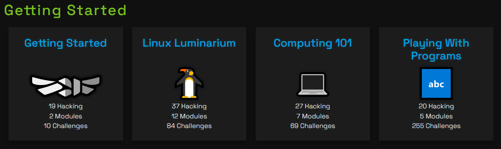

# PWN COLLEGE MAP

## Introduction

Brief introduction to the topic or problem statement.

## Dojos
### Getting Started

1. [Getting Started](https://www.example.com)
2. [Linux Luminarium](https://www.example.com)
3. [Computing 101](https://www.example.com)
4. [Play With Programs](https://www.example.com)

## Results

Provide the results or findings from your analysis.

## Conclusion

Summarize the key points and conclusions.

## References

- [Link 1](https://www.example.com)
- [Link 2](https://www.example.com)

